# Deep Learning-Driven LiDAR Data Processing for Enhanced Indoor Mapping and Robot Navigation
Deep Learning-Driven LiDAR Data Processing for Enhanced Indoor Mapping and Robot Navigation

[![Contributors][contributors-shield]][contributors-url]  
[![Forks][forks-shield]][forks-url]  
[![Stargazers][stars-shield]][stars-url]  
![Issues][issues-shield]

---

## Overview

A full-stack system for **LiDAR-based Indoor Mapping**, **Semantic Segmentation**, **2D Grid Mapping**, and **Reinforcement Learning Navigation**.  
Built using **Python (FastAPI)** and **React (Vite)**, this project visualizes LiDAR scans, performs real-time segmentation, generates occupancy maps, and simulates robot navigation.

---

## Requirements
- **Python 3.10+**
- **FastAPI / Uvicorn**
- **React.js (Vite)**
- **Redux Toolkit**
- **Material UI**
- **NumPy / PyTorch (Segmentation Model)**

---

## Live Project Links
- **UI:**   : http://18.204.128.217:5173/login
- **Backend:** : http://18.204.128.217:8000/health

### Credentials 
User: **m24de3076**  
Password: **m24de3076**
or
User: **admin**  
Password: **admin**

---
## Reports
- [Download the report (PDF)](assets/ProjectReport.pdf)

### Setup Instructions

## 📦 Software & Dataset Requirements

- **Python**              : >= 3.10  
- **VS Code**             : Latest Stable Version  
- **Node.js (with npm)**  : >= 18.x  
- **Dataset**             : Indoor LiDAR Dataset (Zenodo)  


## 🔗 Download Links

| Tool / Dataset | Link                                          |
|----------------|-----------------------------------------------|
| 🐍 Python 3.10 | https://www.python.org/downloads/release/python-3100/ |
| 📝 VS Code     | https://code.visualstudio.com/download        |
| 🟩 Node.js     | https://nodejs.org/en                         |
| 📂 Dataset     | https://zenodo.org/records/13323342           |

### Backend Setup

#### Step 1: Create and Activate Virtual Environment
1. **Create a Virtual Environment**:
```bash
python -m venv venv
python3.10 -m venv venv
(It must be 3.10 Version Python)
```

2. **Activate Virtual Environment**:
Activate:
```bash
source venv/Scripts/activate  # Git Bash
.\venv\Scripts\Activate       # PowerShell
venv\Scripts\activate         # CMD
```

#### Step 2: Install Requirements
```bash
pip install --upgrade pip setuptools wheel
pip install -r requirements.txt
```

#### Step 3: Preprocessing (Optional)
```bash
python convert_npy_to_npz.py
python preprocess_3dses.py
python train_seg.py --epochs 1 --batch_size 1
```

#### Step 4: Start Backend
```bash
uvicorn api:app --reload --host 0.0.0.0 --port 8000
```

---

### Frontend Setup

#### Step 1: Install Node.js Dependencies
Navigate to the project root directory and install the required packages:
```bash
npm install
```

#### Step 2: Run the Frontend Application
Start the development server:
```bash
npm run dev
npm run dev -- --host 0.0.0.0 (To Expose on network)
```

---

## Folder Structure
```
project-root/
├── backend/
│   ├── api.py
│   ├── model/
│   ├── utils/
│   ├── data/
│   └── requirements.txt
├── frontend/
│   ├── src/
│   │   ├── pages/
│   │   ├── components/
│   │   ├── api.js
│   │   ├── App.jsx
│   │   └── main.jsx
│   └── package.json
├── assets/
├── README.md
└── vite.config.js
```

---

## Features

### Backend
- **Segmentation API** (`/segment`, `/segment/random`, `/segment/stream`)
- **Mapping API** (`/map/build`, `/map/get`)
- **RL Navigation** (reset, step, reward system)
- **Sample NPZ download**
- **File handling & preprocessing**

### Frontend
- **Login & Authentication**
- **LiDAR Semantic Segmentation Viewer**
- **2D Occupancy Mapping**
- **Reinforcement Learning Agent Simulation**
- **Batch Segmentation Tool**
- **Explainability Page (Architecture / Flow)**
- **Material UI + Redux Toolkit**

---

## Screenshots

### Login Screen
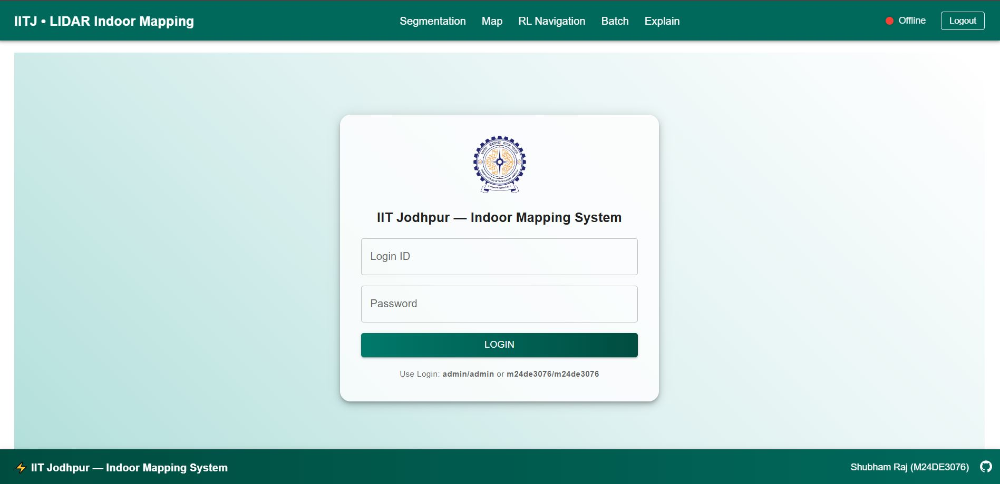

### Login Cred
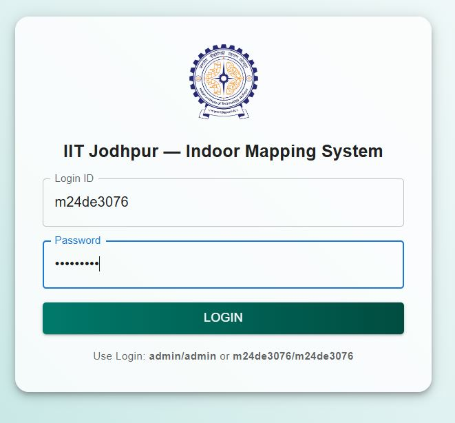

### Landing Screen
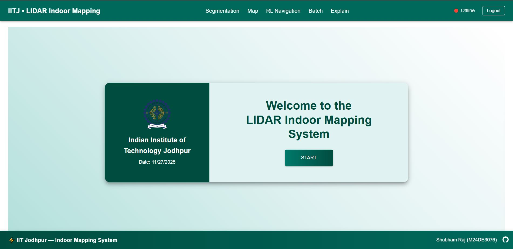

### Backend Connection Screen
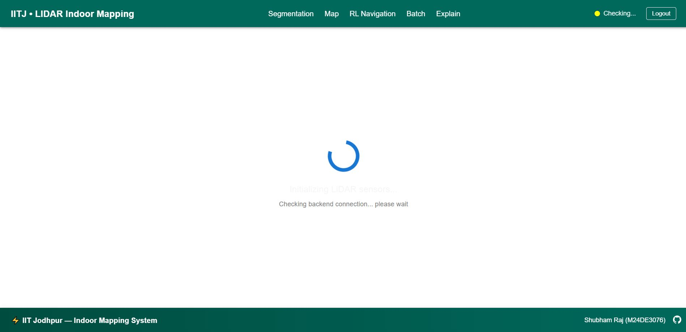

### Backend Connection Failed Screen
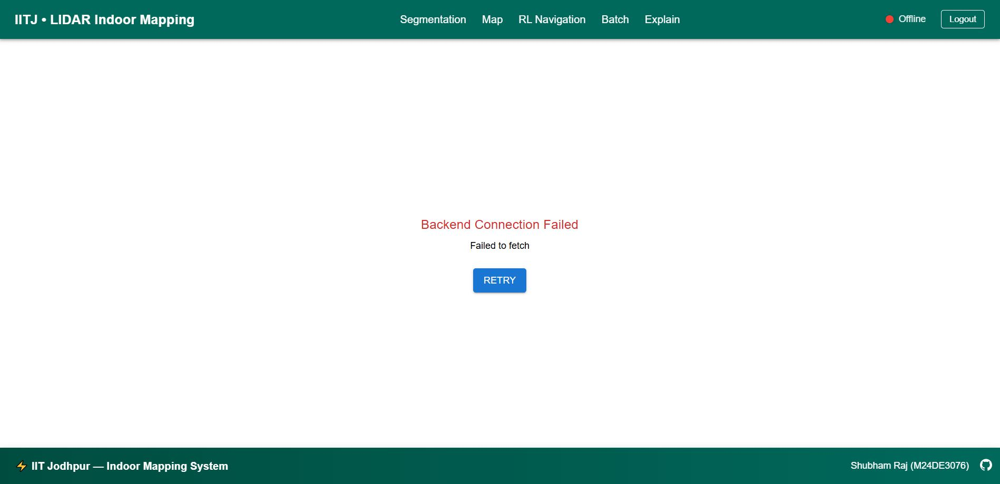

### Backend Connection Success Screen
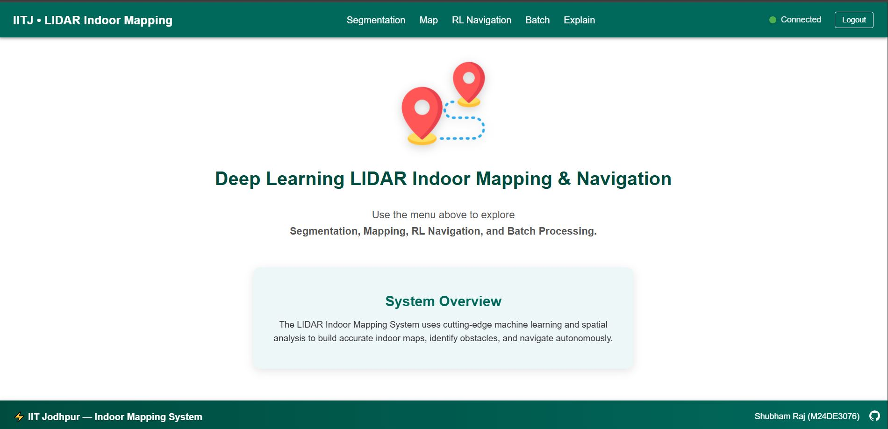
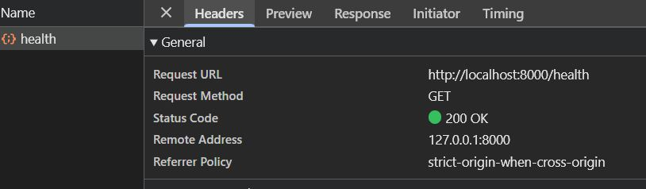

### Segmentation Page
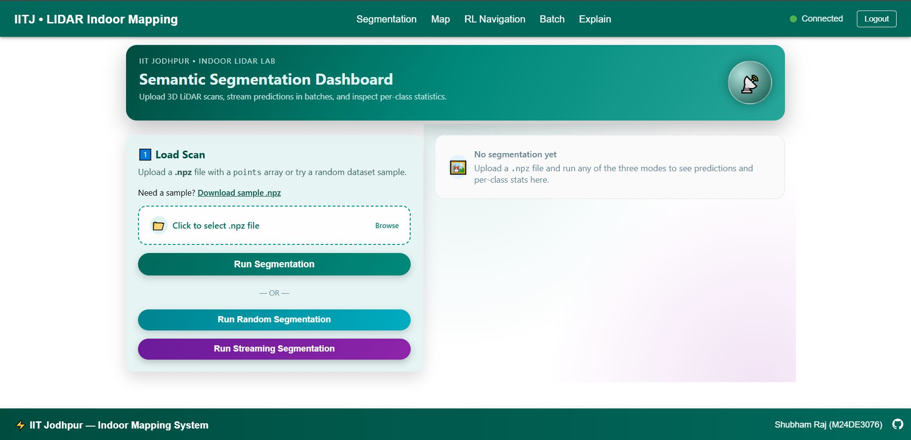


### Occupancy Map
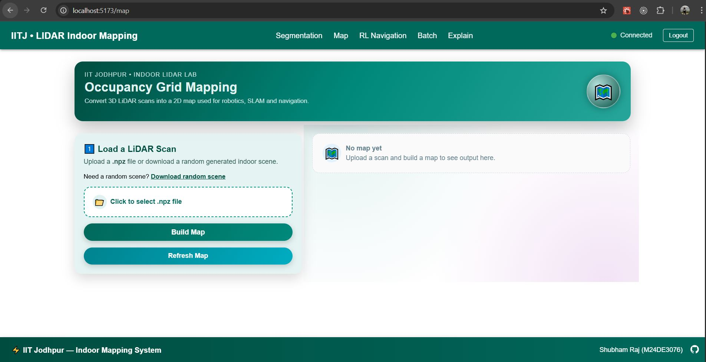


### RL Navigation
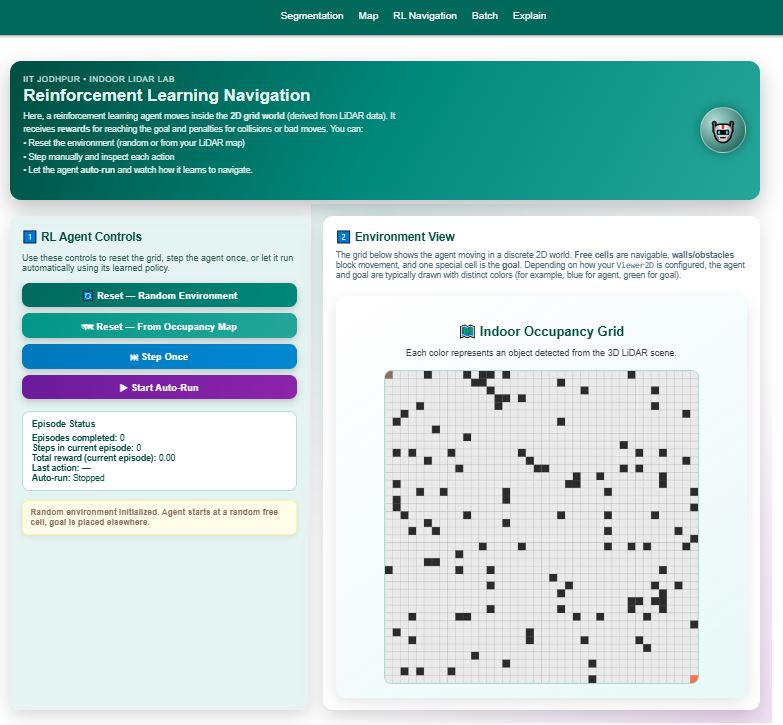


### Batch Processor
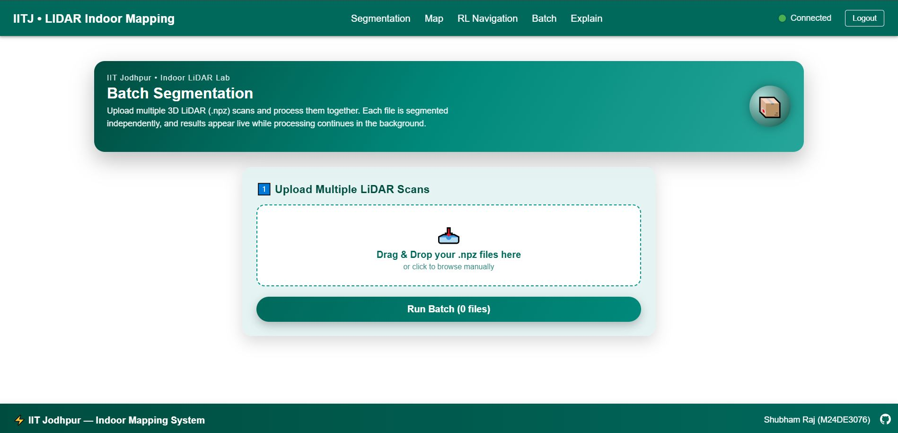


### Explain Page
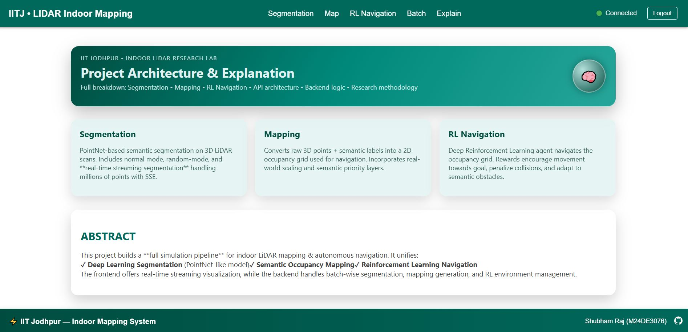

### AWS Page
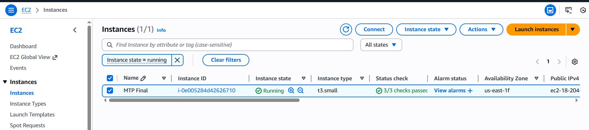
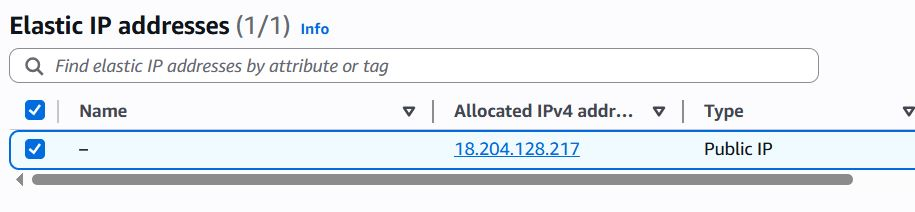

---

## Model Summary

The segmentation model follows a **PointNet-style architecture**:
- Point-wise MLP  
- 1D Convolutions  
- Global Max Pooling  
- Feature concatenation  
- Classifier → 8 indoor classes

Classes:
```
floor, wall, table, chair, door, window, sofa, clutter
```

---

## Authors

👤 **Shubham Raj**  
- GitHub: [@ShubhamRaj](https://github.com/shubham14p3)  
- LinkedIn: [Shubham Raj](https://www.linkedin.com/in/shubham14p3/)

---

## Contributions
Feel free to contribute via issues or pull requests.  
Suggestions for improving segmentation, mapping, or RL logic are welcome.

---

## Show Your Support
⭐ If you like this project, give it a star!

---

## Acknowledgments
- Developed under the guidance of **Dr. Sumit Kalra**, IIT Jodhpur.
- Supported by [IIT Jodhpur](https://www.iitj.ac.in/).

---

<!-- Badges -->
[contributors-shield]: https://img.shields.io/github/contributors/shubham14p3/IITJ-MTP-LIDAR-Project.svg?style=flat-square
[contributors-url]: https://github.com/shubham14p3/IITJ-MTP-LIDAR-Project/graphs/contributors
[forks-shield]: https://img.shields.io/github/forks/shubham14p3/IITJ-MTP-LIDAR-Project.svg?style=flat-square
[forks-url]: https://github.com/shubham14p3/IITJ-MTP-LIDAR-Project/network/members
[stars-shield]: https://img.shields.io/github/stars/shubham14p3/IITJ-MTP-LIDAR-Project.svg?style=flat-square
[stars-url]: https://github.com/shubham14p3/IITJ-MTP-LIDAR-Project/stargazers
[issues-shield]: https://img.shields.io/github/issues/shubham14p3/IITJ-MTP-LIDAR-Project.svg?style=flat-square
